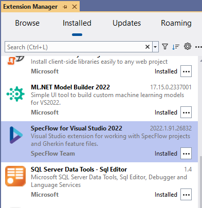
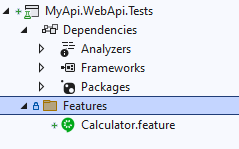
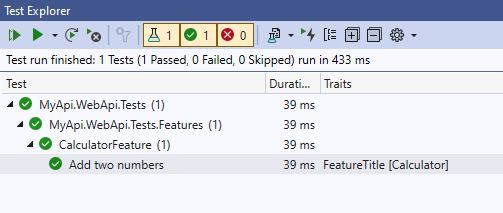

# Module 1: création du projet de test

## Qu'allons-nous faire?

Nous allons partir du template de projet WeatherForecast fourni par Microsoft pour y ajouter le nécessaire afin d'y adjoindre des tests d'intégration.

## Instructions

Démarrer avec le projet créé [ici](https://github.com/jtourvieille/DotNetIntegrationTests/tree/main/src/MyApi)

Créer un projet de type xUnit Test Project


Généralement, on suffixe le nom avec _Tests_. Ici on l'appellera donc _MyApi.WebApi.Tests_.

Dans vos extensions VS, assurez vous que SpecFlow est bien installé.



Si vous utilisez _Rider_, c'est _Reqnroll_ qu'il vous faudra installer.

Ajouter ensuite un fichier specflow _.feature_ permettant de créer un gherkin.



Compléter le test avec le code suivant:

```
Feature: Calculator

Simple calculator for adding **two** numbers

Scenario: Add two numbers
	Given the first number is 50
	And the second number is 70
	When the two numbers are added
	Then the result should be 120
```

Ajouter le package
```
SpecFlow.xUnit
```
au projet de test.

Ensuite, il nous faut ajouter une classe permettant de définir l'implémentation des steps.

```cs
using TechTalk.SpecFlow;

namespace MyApi.WebApi.Tests.Features;

[Binding]
internal class CalculatorSteps
{
    [Given("the first number is (.*)")]
    public void GivenTheFirstNumberIs(int firstNumber)
    {

    }

    [Given("the second number is (.*)")]
    public void GivenTheSecondNumberIs(int secondNumber)
    {

    }

    [When(@"the two numbers are added")]
    public void WhenTheTwoNumbersAreAdded()
    {

    }

    [Then("the result should be (.*)")]
    public void ThenTheResultShouldBe(int expectedResult)
    {

    }
}

```

Pour le moment, on laisse le contenu des steps vides, cette classe n'est qu'un exemple pour vérifier que tout fonctionne. D'ailleurs il est temps de jouer les tests!



Un repo contenant une solution est disponible [ici](https://github.com/jtourvieille/DotNetIntegrationTests/tree/main/modules/Module%201%20création%20du%20projet%20de%20test/src/)

[suivant >](../../Module%202%20lancement%20des%20appels%20http/doc/Readme.md)
