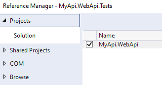

# Module 2: lancement des appels http

Démarrer avec le projet créé [ici](https://github.com/jtourvieille/DotNetIntegrationTests/tree/main/src/MyApi)

Ajouter un projet de test xUnit ainsi qu'une référence à une librairie _SpecFlow.xUnit_, comme mentionné au [module 1](./../../Module%201%20création%20du%20projet%20de%20test/doc/Readme.md)

## Ajout de la WebApplicationFactory

Ajouter la classe qui va permettre de démarrer notre application:

```
Hooks/InitWebApplicationFactory.cs
```

Ajouter ensuite l'attribut _BeforeScenario_ pour pouvoir exécuter du code avant le démarrage d'un scénario gherkin. Ceci va nous permettre de démarrer notre serveur afin de pouvoir le requêter par la suite.

Commencer par ajouter une référence vers le projet web:



Enfin, ajouter la librairie de test _Microsoft.AspNetCore.Mvc.Testing_.

Ceci nous permet de pouvoir initialiser notre WebApplication.

```
using Microsoft.AspNetCore.Mvc.Testing;
using Microsoft.VisualStudio.TestPlatform.TestHost;
using TechTalk.SpecFlow;

namespace MyApi.WebApi.Tests.Hooks;

[Binding]
internal class InitWebApplicationFactory
{
    internal const string HttpClientKey = nameof(HttpClientKey);
    internal const string ApplicationKey = nameof(ApplicationKey);

    [BeforeScenario]
    public void BeforeScenario(ScenarioContext scenarioContext)
    {
        var application = new WebApplicationFactory<Program>();

        var client = application.CreateClient();

        scenarioContext.TryAdd(HttpClientKey, client);
        scenarioContext.TryAdd(ApplicationKey, application);
    }

    [AfterScenario]
    public void AfterScenario(ScenarioContext scenarioContext)
    {
        if (scenarioContext.TryGetValue(HttpClientKey, out var client) && client is IDisposable disposable)
        {
            disposable.Dispose();
        }

        if (scenarioContext.TryGetValue(ApplicationKey, out var application) && application is IDisposable disposableApplication)
        {
            disposableApplication.Dispose();
        }
    }
}

```

Nous allons maintenant ajouter un scénario de test afin de pouvoir accéder à notre API. Pour cela, ajouter un fichier specflow.

```
Features/WeatherWebApi.feature
```

avec le contenu suivant:

```
Feature: WeatherWebApi

Web API for weather forecasts

Scenario: Get weather forecasts
	When I make a GET request to 'weatherforecast'
	Then the response status code is '200'

```

Ensuite, ajouter un fichier permettant d'implémenter ces steps:

```
Features/WeatherWebApiSteps.cs
```

avec le contenu suivant:

```
namespace MyApi.WebApi.Tests.Features;

using Hooks;
using System.Net;
using TechTalk.SpecFlow;

[Binding]
internal class WeatherWebApiSteps
{
    private readonly ScenarioContext _scenarioContext;

    internal const string ResponseKey = nameof(ResponseKey);

    public WeatherWebApiSteps(ScenarioContext scenarioContext)
    {
        _scenarioContext = scenarioContext;
    }

    [When("I make a GET request to '(.*)'")]
    public async Task WhenIMakeAGetRequestTo(string endpoint)
    {
        var client = _scenarioContext.Get<HttpClient>(InitWebApplicationFactory.HttpClientKey);
        _scenarioContext.Add(ResponseKey, await client.GetAsync(endpoint));
    }

    [Then(@"the response status code is '(.*)'")]
    public void ThenTheResponseStatusCodeIs(int statusCode)
    {
        var expected = (HttpStatusCode)statusCode;
        Assert.Equal(expected, _scenarioContext.Get<HttpResponseMessage>(ResponseKey).StatusCode);
    }
}

```

Enfin, pour que le program soit accessible, il faut ajouter une classe partielle sur Program.cs:

```
public partial class Program
{
}
```

Un repo contenant une solution est disponible [ici](https://github.com/jtourvieille/DotNetIntegrationTests/tree/main/modules/Module%202%20lancement%20des%20appels%20http/src/MyApi)
