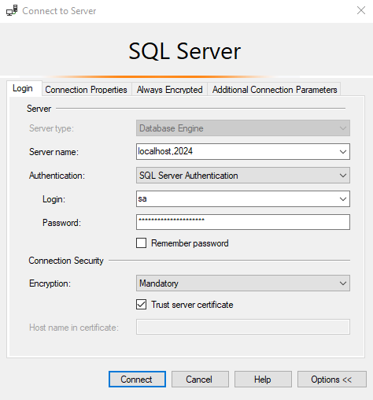
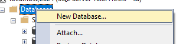
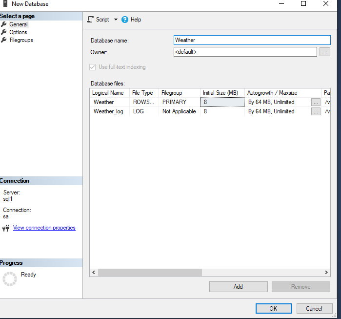

# Module 4: remplacement de la database

## Création de la database

Pour commencer, nous allons créer une database dans le projet d'implémentation.

Dans une invite de commande de type powershell, lancer la commande suivante:

```
docker run -e "ACCEPT_EULA=Y" -e "MSSQL_SA_PASSWORD=<YourStrong@Passw0rd>" -p 2024:1433 --name sql1 --hostname sql1 -d mcr.microsoft.com/mssql/server:2022-latest
```

Cela permettra de lancer un server sql dans un docker.

Ouvrir ensuite un SSMS sur cette instance:



Puis créer une database _Weather_:





Créer ensuite la table WeatherForecast:

```
CREATE TABLE [dbo].[WeatherForecast](
	[Id] [int] IDENTITY(1,1) NOT NULL,
	[Date] [date] NOT NULL,
	[TemperatureC] [int] NOT NULL,
	[Summary] [nvarchar](2000) NULL,
 CONSTRAINT [PK_WeatherForecast] PRIMARY KEY CLUSTERED 
(
	[Id] ASC
)WITH (PAD_INDEX = OFF, STATISTICS_NORECOMPUTE = OFF, IGNORE_DUP_KEY = OFF, ALLOW_ROW_LOCKS = ON, ALLOW_PAGE_LOCKS = ON, OPTIMIZE_FOR_SEQUENTIAL_KEY = OFF) ON [PRIMARY]
) ON [PRIMARY]
```

Enfin, on va l'alimenter avec des données:

```
INSERT [dbo].[WeatherForecast] ([Date], [TemperatureC], [Summary]) VALUES (CAST(N'2024-01-01' AS Date), -5, N'Freezing')
GO
INSERT [dbo].[WeatherForecast] ([Date], [TemperatureC], [Summary]) VALUES (CAST(N'2024-07-01' AS Date), 25, N'Chilly')
GO
INSERT [dbo].[WeatherForecast] ([Date], [TemperatureC], [Summary]) VALUES (CAST(N'2024-08-15' AS Date), 35, N'Hot')
GO
```

## Utilisation de la database dans l'implémentation

Il faut maintenant se connecter à la base de données dans notre application.

On commence par référencer EntityFramework, qui sera notre ORM.

```
Microsoft.EntityFrameworkCore.SqlServer
```

Puis on ajoute la chaine de connexion dans le fichier appsettings.json:

```
"ConnectionStrings": {
  "WeatherContext": "Data Source=127.0.0.1,2024;Initial Catalog=Weather;User Id=Sa;Password=<YourStrong@Passw0rd>;Connect Timeout=30;Encrypt=False;TrustServerCertificate=False;ApplicationIntent=ReadWrite;MultiSubnetFailover=False"
}
```

Puis Créer le WeatherContext:

```
using Microsoft.EntityFrameworkCore;

namespace MyApi.WebApi;

public class WeatherContext : DbContext
{
    public WeatherContext()
    {
    }

    public WeatherContext(DbContextOptions<WeatherContext> options)
        : base(options)
    {
    }

    public virtual DbSet<DbWeatherForecast> WeatherForecasts { get; set; } = null!;

    protected override void OnModelCreating(ModelBuilder modelBuilder)
    {
        modelBuilder.Entity<DbWeatherForecast>(entity =>
        {
            entity.ToTable("WeatherForecast");
            entity.HasKey(e => e.Id);
            entity.Property(e => e.Date).IsRequired();
            entity.Property(e => e.TemperatureC).IsRequired();
            entity.Property(e => e.Summary);
        });
    }
}

```

```
public class DbWeatherForecast
{
    public int Id { get; set; }

    public DateOnly Date { get; set; }

    public int TemperatureC { get; set; }

    public string? Summary { get; set; }
}

```

Ensuite, on peut le référencer dans notre démarrage d'application:

```
var connectionString = builder.Configuration.GetSection("ConnectionStrings")["WeatherContext"];

builder.Services.AddDbContext<WeatherContext>(options =>
    options.UseSqlServer(connectionString, providerOptions =>
    {
        providerOptions.EnableRetryOnFailure();
    }));
```

Il ne nous reste plus qu'à utiliser notre contexte dans le controller afin de renvoyer les données de la base.

```
using Microsoft.AspNetCore.Mvc;

namespace MyApi.WebApi.Controllers;

[ApiController]
[Route("[controller]")]
public class WeatherForecastController : ControllerBase
{
    private readonly WeatherContext _weatherContext;

    public WeatherForecastController(WeatherContext weatherContext)
    {
        _weatherContext = weatherContext;
    }

    [HttpGet(Name = "GetWeatherForecast")]
    public IEnumerable<WeatherForecast> Get()
    {
        var allWeathers = _weatherContext.WeatherForecasts.ToList();

        return allWeathers.Select(dbWeather => new WeatherForecast
        {
            Date = dbWeather.Date,
            TemperatureC = dbWeather.TemperatureC,
            Summary = dbWeather.Summary
        });
    }
}

```

## Utilisation de Testcontainers

Référencer les packages

```
Microsoft.Data.SqlClient
Testcontainers.MsSql
```

dans le projet de tests.

On va ensuite créer un MsSqlContainer pour héberger notre database:

```
private MsSqlContainer _msSqlContainer = null!;

[...]

_msSqlContainer = new MsSqlBuilder()
    .Build();

await _msSqlContainer.StartAsync();
```

Puis on va créer la méthode ReplaceDatabase:

```
private void ReplaceDatabase(IServiceCollection services)
{
    services.RemoveAll<DbContextOptions<WeatherContext>>();
    services.RemoveAll<WeatherContext>();

    services.AddDbContext<WeatherContext>(options =>
        options.UseSqlServer(_msSqlContainer.GetConnectionString(), providerOptions =>
        {
            providerOptions.EnableRetryOnFailure();
        }));
}
```

qu'on appellera à la suite du ReplaceLogging:

```
var application = new WebApplicationFactory<Program>()
    .WithWebHostBuilder(builder =>
    {
        builder.ConfigureTestServices(services =>
        {
            ReplaceLogging(services);
            ReplaceDatabase(services);
        });
    });
```

Enfin, on n'oublie pas de stopper & disposer le container une fois le scénario terminé:

```
await _msSqlContainer.StopAsync();
await _msSqlContainer.DisposeAsync().AsTask();
```